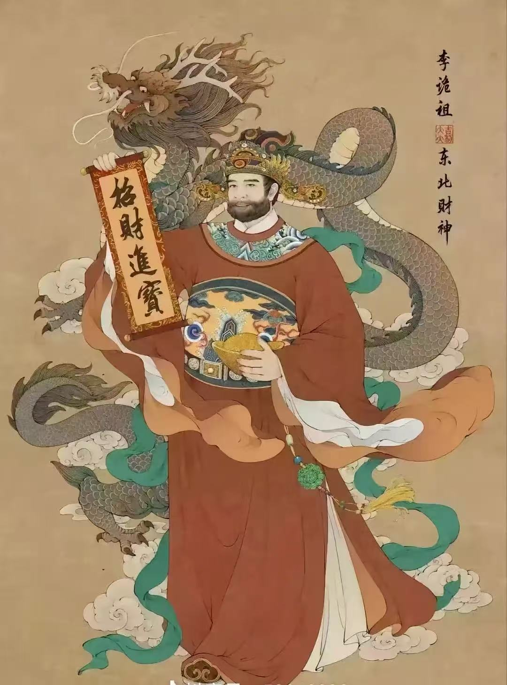

---
ebook:
  title: Test
  authors: Test

# 以下设置可能有助于图片路径处理
markdown:
  # 导出时图片的保存目录（相对于输出文件）
  image_dir: /csm_asset
  # 尝试使用绝对图片路径（相对于项目根目录）
  absolute_image_path: true
---

# 财神庙

南宋的寺庙，距今已有近1700年历史，也是杭州最早的财神古刹，由印度高僧慧理和尚在东晋年间创建。天下第一财神庙，原名灵顺寺，位于西湖景区附近的北高峰山顶。灵顺寺最初是因其内供奉的“五显财神”而在北宋年间被誉为“财神庙”，明代时因设殿别名“华光”又称为“华光庙”。公园326年至今，历代帝王、文人墨客多登临。宋徽宗、清康熙帝、乾隆帝都曾为此处题词。民间传说财神庙十分灵验，因此也有很多人来此祈福。明代书画家徐文长在匾额上提书“天下第一财神庙”后，这也成为了该寺庙的新名字。

## 游览指南

穿过牌坊，首先映入眼帘的是**弥勒佛**与**韦陀菩萨**的金身法相，他们身前各置一大元宝，在阳光的照耀下，熠熠生辉，仿佛财气扑面而来。

门前，一对**瑞兽貔貅**肃立，象征着财源广进。门楣之上，高悬着“灵顺寺”的匾额，古朴而庄重。

步入殿内，一位身着王爷装扮的财神端坐在中央，左手托着如意，右手握着寓意“恭喜发财”的楹联，彰显着其掌管财富的尊贵地位。

穿过山门殿，便来到一进式的四合院。首先映入眼帘的是一尊威风凛凛的**武财神关羽**像。其左侧是文财神殿，殿内供奉着千尊**财帛星君**，象征着财富与智慧的结合。右侧则是武财神殿，殿内千余尊武财神圣像庄严肃穆，吸引着众多前来祈福的信众。

**大雄宝殿**内，一块“财神真君”的匾额高悬，这是乾隆皇帝的御赐，彰显着这座殿宇在寺院中的至高地位。殿中央，**释迦牟尼佛**的庄严塑像居中安坐，其左右两侧，**摩诃迦叶**（Mahākāśyapa）佛陀十大弟子之首，头陀第一（苦行典范） 与**阿难陀**（Ānanda）佛陀堂弟，侍佛25年，多闻第一（记忆超群）两大弟子分列站立。

1. **摩诃迦叶**
年老消瘦，面容肃穆，双手合十或持杖（头陀行者特征）。
常位于佛的左侧（以佛的视角为准
2. **阿难陀** 
年轻俊秀，双手合十或捧经卷。
常位于佛的右侧（以佛的视角为准）。

在佛祖两旁的宝座上，两大财神分别受供：五色财神之首的**黄财神藏巴拉**，其上悬有“生财有道”的匾额，象征着财富的智慧与道义；而另一侧则是道教的五路财神之首玄坛真君**赵公明**，其上则挂着“财源广进”的匾额，寓意着财富的源源不断。

殿宇左侧，千余尊文财神的圣像布满墙壁，其中最引人注目的是**地藏王菩萨**的法相。而右侧则供奉着千余尊武财神的坐像，最深处则是道教的**神仙太白金星**。

大殿背后还供奉着三大士：居中的是**观世音菩萨**的塑像，其两侧的**善财童子**和**龙女二胁侍**以及背后的众多神仙塑像，共同构成了一幅庄严而神圣的画卷。壁塑的两侧则是**文殊菩萨**和**普贤菩萨**的精美画像。

### 道教财神体系
1. **文财神**
(1) **比干**
来源：商朝忠臣，因谏纣王被挖心，因“无心”而公正无私。
形象：头戴宰相帽，手持如意或元宝，面容慈祥。
职能：掌管正财，适合公务员、文人、求稳定财运者。

(2) **范蠡**
来源：春秋时期越国谋士，助勾践复国后隐居经商，三次散财又三次致富。
形象：儒商打扮，手持书卷或聚宝盆。
职能：象征智慧生财，适合商人、创业者。

(3) **财帛星君（李诡祖）**
身份：北魏官员，被唐太宗封为“财神”，主管财库。
象征：禄位与稳定收入，传统商铺、家庭常供奉。
形象：白面长须，手持“招财进宝”卷轴或元宝。

2. **武财神**
(1) **赵公明**
来源：道教护法神，封神演义中统领“五路财神”。
形象：黑面浓须，骑黑虎，持钢鞭或元宝。
职能：主掌招财、镇邪、偏财（如投资、彩票）。

(2) **关羽（关圣帝君）**
来源：三国名将，明清后被奉为武财神。
形象：红脸长须，持青龙偃月刀，左右关平、周仓。
职能：象征忠义生财，商帮、黑道、警察均拜，兼顾护财、防小人。

类别	代表神祇	适合人群	求财类型	供奉场景
**文财神**	比干、范蠡、财帛星君	文人、公务员、传统行业	正财（稳定收入）	家庭、文职办公
**武财神**	赵公明、关羽	商人、投资者、高风险行业	偏财（快速招财）	商铺、武职场所

3. 五路财神（五显财神）
来源：道教“五路财神”指赵公明及其四位部将（招宝、纳珍、招财、利市），合称“五路”，象征东西南北中五方财运。
职能：全面招财，商户常拜。

大五路财神（主流且最公认）
- 中路财神：赵公明，形象多为黑面浓须，骑黑虎，手持金鞭。他掌管着世间的财源禄库。
- 东路财神：招宝天尊 萧升， 神器：招宝金盆，原是峨眉山罗浮洞的仙人，在《封神演义》中，他用“落宝金钱”收了赵公明的金蛟剪
- 南路财神：招财使者 陈九公，神器：招财幡，是赵公明的徒弟部下，擅长经营之道，能为人招来财运。
- 西路财神：纳珍天尊 曹宝，神器：纳珍玉盆，简介：与萧升是好友，同样在《封神演义》中出现，协助姜子牙，后被封为纳珍天尊，掌管天下的珍宝。
- 北路财神：利市仙官 姚少司，神器：利市金盆，也是赵公明的徒弟部下，被称为“利市仙官”。“利市”在俗语中意为好运、发财，他专门掌管商贾的利润好运，深受商人供奉。

主流道教与民间信仰的“五大财神”
- 中路财神 - 王亥，他是中国商业的鼻祖，发明了牛车，鼓励族人用牛车拉着货物去和其他部落进行交易。他所从事的行当叫做“王业”，所以被尊为“中路财神”或“大财神”。

- 东路财神 - 比干，传说他被纣王挖心后，因没了“心”，所以办事公平，无私心，不偏不倚。被奉为文财神，掌管东路。

- 南路财神 - 柴荣，他年轻时经营瓷窑、贩卖雨伞等生意，发家致富，后来当了皇帝。百姓尊其为“柴王爷”或“天财星君”下凡。他掌管南路。

- 西路财神 - 关公，商人做生意最重“信用”和“义气”，关公是忠义的化身，因此被奉为武财神。同时，传说关公擅长算数，发明了“日清薄”。他掌管西路

- 北路财神 - 赵公明，在《封神演义》中，姜子牙封赵公明为“金龙如意正一龙虎玄坛真君”，率领“招宝”、“纳珍”、“招财”、“利市”四位仙官，专司迎祥纳福、商贾买卖。他是最正统、最专业的财神。他掌管北路。

- 东北财神

- 东南财神

- 西北财神

- 西南财神

### 佛教财神体系

佛教财神主要来自藏传佛教（密宗），汉传佛教中财神较少，但部分菩萨（如观音、弥勒）也被视为赐福之神。

1. 藏传佛教的财神多为护法神，分五色对应五方佛，各司不同财运：
财神名	颜色	象征	职能
**黄财神**	黄色	中央财神（主尊）	主财富增长，最受欢迎  Jambhala

**白财神**	白色	观音化身	除贫苦，求清净财 Jambhala Gape

**红财神**	红色	怀爱、权势	求人缘财、事业成功 Jambhala Marpo

**黑财神**	黑色	祛除业障	适合穷人，快速招偏财 Jambhala Nagpo

**绿财神**	绿色	增长功德	农业、健康相关财运 Jambhala Jangpo

财神	藏文名（转写）	梵文名	汉译全称
**黄财神**	རྣམ་ཐོས་སྲས་པོ་ (Namthöse)	Jambhala	黄瞻巴拉（藏巴拉）
**白财神**	རྣམ་ཐོས་སྲས་དཀར་པོ་ (Namthöse Karmo)	Sita Jambhala	白瞻巴拉
**红财神**	རྣམ་ཐོས་སྲས་དམར་པོ་ (Namthöse Marpo)	Rakta Jambhala	红瞻巴拉
**黑财神**	རྣམ་ཐོས་སྲས་ནག་པོ་ (Namthöse Nagpo)	Krishna Jambhala	黑瞻巴拉
**绿财神**	རྣམ་ཐོས་སྲས་ལྗང་པོ་ (Namthöse Jangpo)	Harita Jambhala	绿瞻巴拉

🙏 五显财神的祈福人群
**黄财神**：作为财神之首，适合所有人（八方来财）
**红财神**：适合位高权重者（聚人聚财）
**白财神**：希望增福添寿招财者（福寿双全）
**绿财神**：适合求功德圆满事业有成的人（和气生财）
**黑财神**：穷人的财神（招财进宝）

2. 汉传佛教中的“财神”
**弥勒佛**：笑口常开，象征福气，间接助财运。
**地藏王菩萨**：虽主超度，但民间认为其护佑家宅财富稳固。

### 如何选择适合自己的财神？

求正财（工资、事业）：拜比干、范蠡、黄财神。
求偏财（投资、彩票）：拜赵公明、黑财神、刘海蟾。
经商防小人：拜关羽、红财神。
求快速招财：黑财神、五路财神。

1. **观世音菩萨（大悲）**
象征：无缘大慈、同体大悲
道场：浙江普陀山
形象：
常见白衣观音、千手千眼观音、杨柳观音等化身，手持净瓶与杨柳枝，象征洒净世间苦难。
藏传佛教中为四臂观音、十一面观音等。

礼拜意义：

救苦救难：祈求现世安乐，解脱疾病、灾难、恐惧等。
慈悲心：修习观音菩萨的平等慈悲，对一切众生起怜悯心。
求子/平安：民间尤其信奉送子观音，祈求子嗣或家庭平安。
经典：《妙法莲华经·观世音菩萨普门品》《心经》（观音为般若智慧化身）。

2. **文殊菩萨（大智）**
象征：般若智慧、斩断愚痴
道场：山西五台山
形象：
手持智慧剑（断烦恼）和般若经（表智慧），骑青狮子（喻智慧威猛）。
童子形，象征纯净无染的智慧。

礼拜意义：
开智慧：学子、修行者祈求学业进步、辩才无碍、破除迷惑。
明心见性：助人领悟佛法空性，直达实相。
职场/决策：商人或管理者求清晰判断，避免愚痴决策。
经典：《文殊师利所说般若经》《华严经》。

3. **普贤菩萨（大行）**
象征：实践力行、广大愿行
道场：四川峨眉山
形象：
骑六牙白象（表忍辱负重、行愿坚定），手持如意或莲花。
常与文殊菩萨同为释迦牟尼佛的胁侍，代表“解行并重”。

礼拜意义：
行愿圆满：求事业、修行中能持之以恒，落实理想。
忏悔业障：普贤十大愿王（如礼敬诸佛、忏悔业障）是修行指南。
护佑行者：长途旅行或发大愿者常拜，祈求顺遂。
经典：《普贤行愿品》《法华经·普贤菩萨劝发品》。

4. **地藏王菩萨（大愿）**
象征：愿力无尽、救度地狱
道场：安徽九华山
形象：
比丘相，持锡杖与宝珠，脚踏莲台或坐谛听神兽。

礼拜意义：
超度亡灵：为亡者祈福，避免堕入恶道，常诵《地藏经》。
消业障：忏悔重罪，减轻因果报应。
孝亲报恩：因地藏曾救母，强调孝道与因果教育。
经典：《地藏菩萨本愿经》《占察善恶业报经》。

总结：四大菩萨的信仰核心
**菩萨**	象征	拜求重点	适用场景
**观音**	大悲	现世平安、救苦、慈悲心	危难、疾病、求子、日常祈福
**文殊**	大智	智慧增长、学业事业、破迷开悟	考试、决策、修行开悟
**普贤**	大行	行愿坚定、事业成就、忏悔业障	创业、修行、长途旅行
**地藏**	大愿	超度亡灵、消业障、孝亲	丧葬、祖先超度、因果忏悔

### 妙句
封建迷信我充耳不闻，
财神庙里我长跪不起

### 拜佛模板
尊敬的xxx
某某➕祖籍➕现住地址，也可以报身份证号
愿望：清晰明了，数字精准，忌假大空
还愿：许完愿后，承诺愿望实现后怎么来还愿，最好与行善积德相关，要具体精准
