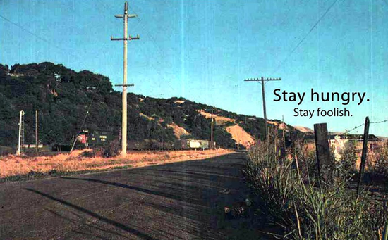

---
ebook:
  title: Test
  authors: Test
  args: ["--embed-all-fonts", "--preserve-cover-aspect-ratio"]

# 以下设置可能有助于图片路径处理
markdown:
  # 导出时图片的保存目录（相对于输出文件）
  image_dir: /net_asset
  # 尝试使用绝对图片路径（相对于项目根目录）
  absolute_image_path: true
---

## 戴旭09年关于GDP的理论
---------
- GDP构成是什么？你有100万，我也有100万，你的100万是卖儿，卖女，卖出来的。
- 战争是双方GDP质量的对撞，不是GDP数量的比较。
- 不具备国防转换能力的GDP，实际上就是狗的屁，汉语翻译过来就是这样。
- 我们的GDP构成，房地产，纺织品，烟酒，玩具。
- 国家高技术发展城市，如北京，上海，也去发展房地产。肥大不等于强大，重量不等于力量。
- 搞房地产，秦朝最好的房地产是阿房宫，清朝最大的房地产是圆明园，最后都是洋人一句可怜焦土。
- 我们的房地产已经完全失控，房地产市场已经成为国内的这个垄断资本和国际游资联合打劫中国人民财富的战场。

## 这才是顶级三观
----------
- 除了生病之外，你感受到的所有的痛苦，都是价值观带来的。
- 就算公交车上空无一人，司机也会把车开到终点站，我的意思是，你不要因为任何人的离开，而停止原本的生活。
- 
## 博弈论：处事
----------
说话只要声音一低，
你的声音就会有磁性，
说话只要一慢，你就会有气质。
你敢停顿，就能显示出你的权威。

任何时候不要紧张，
永远展现舒适放松的状态
永远把任何你想要接触的人，
当成老朋友交谈，
行就行，不行就拉倒，
就是博弈论谈判。
能解决很多问题，沉默能避免许多问题。

## 其它
---------
努力的意义，不是要鹤立鸡群，而是要离开那群鸡。
真正的成功，不是被旧环境捧上神坛，而是有能力走进新世界。

## 人民日报摘抄
---------
- 最好的抗抑郁法是运动
- 最好的养生是不养生
- 最好的睡眠是不怕失眠
- 最好的生活是吃喝玩乐

## 演讲

- 如果你把每一天都当作是人生的最后一天，总有一天，你会是对的。
- 如果今天是我生命中的最后一天，我还会做我今天要做的这些事吗？如果连续很多天答案都是“不”，我就知道需要改变了。
- 几乎所有的事情，所有的期望，所有的荣耀，对失败的恐惧，一切都会在死亡面前淡去，只留下真正重要的东西。
- 你本就一无所有, 没有理由不去追随你的内心。（You are already naked, thers is no reason not to follow your heart）
- 死亡就是生命最好的发明，是生命更迭的动力，它去除老旧，拥抱新生。
- 一副清晨乡村公路的照片，是那种你要去搭便车旅行的话，就会看到的角色。Stay Hungry，Stay Foolish。（Whole Earth Catalog-Stewart Brand 70年代中期 停刊告别语）

## 